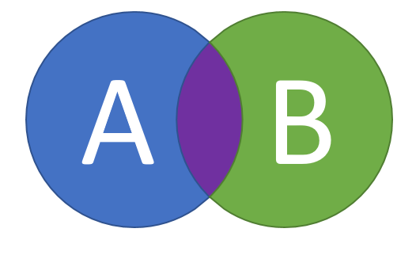
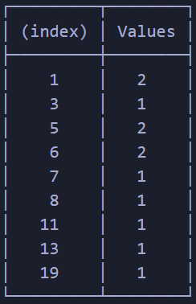

# Counter - 記分板

這個名稱並非正式，因為概念是累計，像記分板一樣，所以普遍都這稱呼。

#### 目的

用於找尋相同值的值。  
如同數學名稱中的交集，如下圖，紫色區塊就是要找的值。



#### 實際情況

從兩個陣列中，找出重複的值。

```js
const A = [1, 3, 5, 6, 8]
const B = [19, 11, 13, 6, 7, 5, 1]

// 直覺的方式
for (let i = 0; i < A.length; i++) {
  for (let j = 0; j < B.length; j++) {
    if (A[i] === B[j]) {
      console.log(A[i])
    }
  }
}
```

#### 但直覺的方式確實解決了問題但卻不是最佳解

```js
// 記分板的概念
const A = [1, 3, 5, 6, 8]
const B = [19, 11, 13, 6, 7, 5, 1]
const arr = A.concat(B) // 將兩個陣列合併
const counter = {} // 記分板，初始值為空，如同白紙一般

// 這邊使用 forEach 代替 for loop 語法
arr.forEach((number) => {
  if (counter[number]) {
    counter[number] += 1 //白紙上有出現過就在加一分，如同我們會畫正記號一般。
  } else {
    counter[number] = 1 // 沒有出現過就記一分
  }
})

// 把 counter 打印出來
console.table(counter)
```

#### 結果會如同以下圖片般

被記錄兩次的即為重複，就是要找的交集值。


