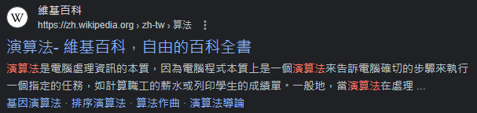
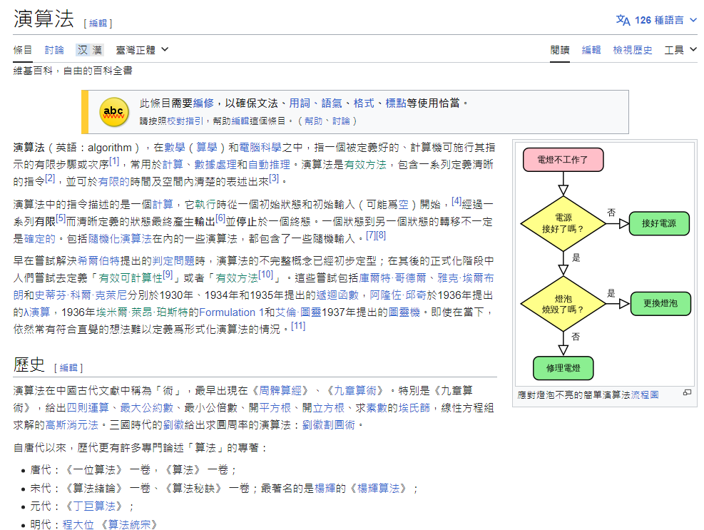

<h1 align='center'>Algorithm - 演算法</h1>

> _「Youtube 的演算法讓我看到這部影片」_

相信你曾看過或聽過這句話，但不認識它。  
沒關係 （￣︶￣）↗ 　  
很巧的是我也不認識，所以現在才在學習。

## 介紹

何謂演算法，若你到 google 搜尋，應該會看到

然後你點開頁面後會看到

原來是這樣啊！

最好 (╬▔ 皿 ▔)╯  
根本完全不懂啊ㄚㄚㄚㄚ...  
跟我一樣看不懂的請出個聲讓我知道我不孤單 QQ

但如果就這樣放棄那還做啥筆記 🤔  
所以為了搞懂它  
我們有請 ChatGPT 大神來替我們解惑

### 用簡單的方式理解它

> 我可以透過比喻方式來解釋何謂演算法。
>
> 想像你正在烹飪一道菜，菜譜就是一個演算法。演算法是一系列明確的步驟，告訴你應該如何處理食材和烹調方法，以最終做出一道美味的菜。
>
> 在這個比喻中：
>
> - "演算法" 就相當於整個菜譜。
>
> - "一系列明確的步驟" 就是演算法中的指令，  
>   它們告訴你應該按照特定的順序和方式進行操作。
>
> - "解決一類問題" 就相當於菜譜解決了製作特定類型的菜的問題。
>
> - "執行計算" 也可以想像成你在烹飪過程中進行的計算，  
>   例如計算食材的份量或烹調時間。
>
> 總之，演算法就像是一個指導，  
> 告訴你如何逐步執行特定任務或解決特定問題。  
> 這個指導通常以計算機可以理解和執行的方式來描述，  
> 以便實現特定的目標。

來哦，看得懂得請舉個手讓我看看 ~  
這樣是不是好理解了些呢 ?

### 還不理解嘛

倘若還是不太理解的話  
我這邊在舉個例子

> 想像你買了個 IKEA 的櫃子回來  
> 並按照說明書上寫的步驟安裝櫃子  
> 最後完成櫃子的組裝，得到了櫃子
>
> 當中  
> 演算法就是'說明書'  
> '櫃子'就是成品

### 現在我們把 youtube 結合起來

當你進到 youtube 頁面，會開始載入影片  
(等同於 youtube 正在按照說明書組裝櫃子中)

載入完之後你看到了影片  
(等同於 youtube 已經把櫃子組裝好了)

### 結論

所以演算法等於程式碼嘛 ?  
其實不是  
**演算法** 是一個一般性的概念，它代表了解決問題的 **方法論** 或 **指導**  
而程式碼是演算法的一種實現方式
